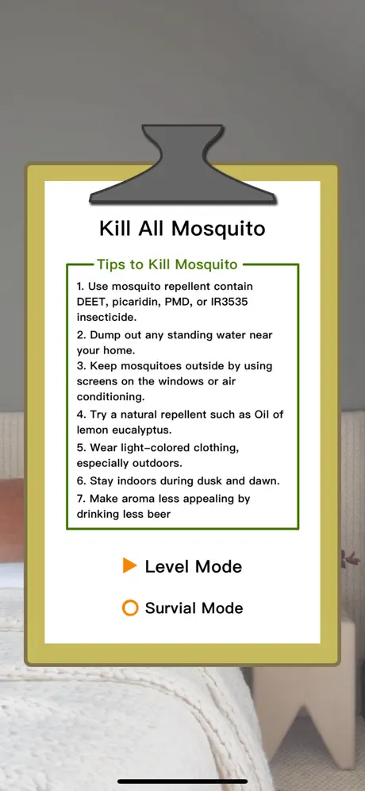
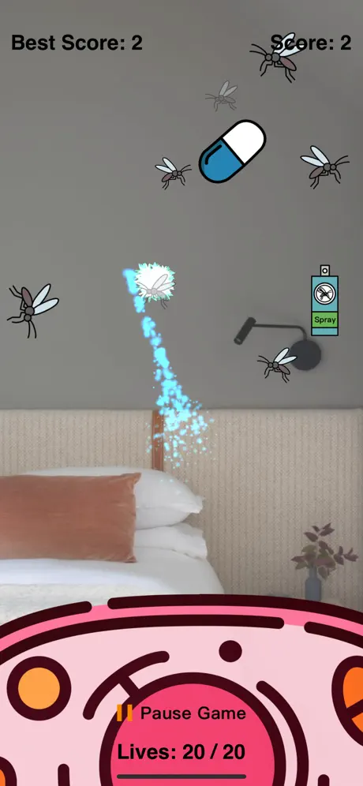

# Mosquito Killer: Mosquito Game

**Mosquito Killer: Mosquito Game** is an exciting and addictive iOS and Mac app where you zap mosquitoes to score points. Stay sharp to avoid missing those pesky bugs! Built using Swift and SpriteKit, this game offers a simple yet challenging experience for players of all ages.

    
    
    

## Game Description

In **Mosquito Killer: Mosquito Game**, your mission is to eliminate mosquitoes buzzing around the screen to rack up points. Act fast to zap them before they escape, but be careful—missing a mosquito might cost you!

### Scoring System

- **Mosquitoes:** +5 points for each mosquito zapped.
- **Missed Mosquitoes:** -1 point for each mosquito that gets away.

Precision and speed are key to achieving a high score!

## Game Features

- **Swift & SpriteKit:** Crafted with Swift and SpriteKit for a smooth and responsive gaming experience.
- **Engaging Sound Effects:** Hear satisfying zaps and ambient sounds as you take down mosquitoes.
- **Increasing Difficulty:** Mosquitoes spawn faster as the game progresses, keeping you on your toes.
- **High Score Tracking:** Your best score is saved using `UserDefaults`, so you can challenge yourself to beat it.
- **Pause Functionality:** Pause the game to take a break, with options to resume or return to the main menu.

## Game Logic

The game includes the following core mechanics:

- **Sound Effects:** Immersive audio feedback for zapping mosquitoes and background ambiance.
- **Gameplay Area:** A defined playable area where mosquitoes spawn and move unpredictably.
- **Touch Controls:** Tap or swipe to zap mosquitoes with intuitive controls.
- **Pause Menu:** Pause the game at any time to resume or exit to the main menu.
- **Spawn System:** Mosquitoes appear in waves, with spawn rates increasing to ramp up the challenge.

## Technologies Used

- **Language:** Swift
- **Framework:** SpriteKit
- **Platforms:** iOS, macOS

## How to Play

1. Tap or swipe to zap mosquitoes as they appear on the screen.
2. Earn points for each mosquito you eliminate, but avoid missing them to prevent point deductions.
3. Track your high score and aim to beat it with every game!

## Download

The game is available for download on the [App Store](https://apps.apple.com/nz/app/mosquito-killer-mosquito-game/id1513712754?platform=iphone).
